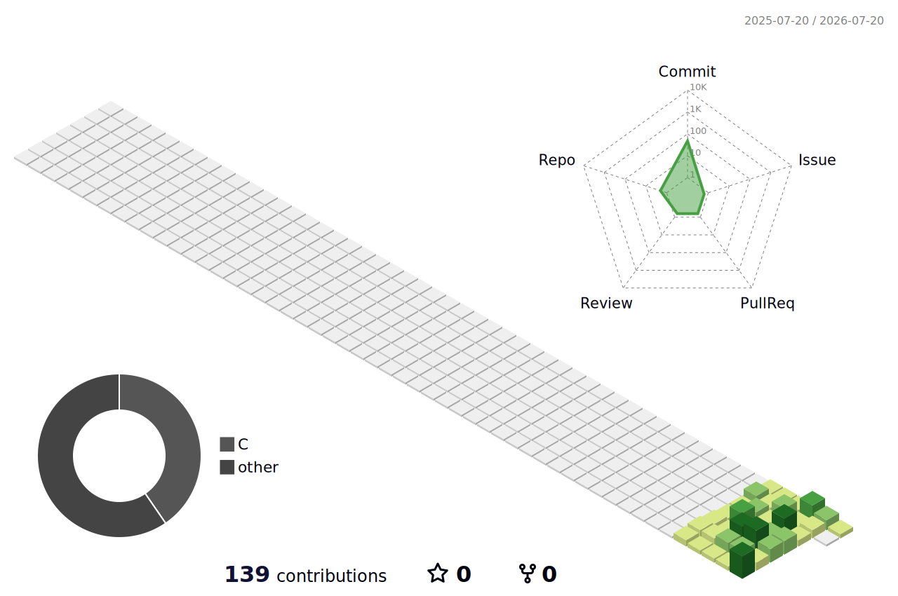

## Hi 👋, I'm Blaze

  &nbsp;&nbsp;

  &nbsp;&nbsp;

  &nbsp;&nbsp;

  

Building at the intersection of **embedded systems and machine learning**.

My focus is TinyML — compressing and deploying neural networks onto microcontrollers
where memory is measured in kilobytes, compute is measured in milliwatts, and the
cloud is not an option.I find the constraint driven engineering of this space more
interesting than unconstrained cloud ML.

---

### Currently building

- **Keyword spotting system** — wake-word detection running on-device,
  target model size under 50KB of flash
- **Quantization study** — measuring the accuracy/latency/size tradeoff
  when compressing float32 models to int8 for embedded deployment
- **Open-source work** — working toward contributions in TensorFlow Lite Micro

### Technical stack

Embedded side: C++, digital systems, microcontrollers, communication protocols

ML side: Python, TensorFlow Lite, Edge Impulse, Kaggle for training compute

Environment: WSL2 + Ubuntu + Conda + VS Code

### Currently learning

- Practical deep learning - fast.ai
- TensorFlow Lite for Microcontrollers
- Embedded firmware engineering

## 🛠️ Tech Stack

### Languages

  

### AI • Machine Learning • Computer Vision

  

  
  
  

### Development

  

### Operating Systems

  

### Engineering

  
  

### Currently Learning

  
  
  

